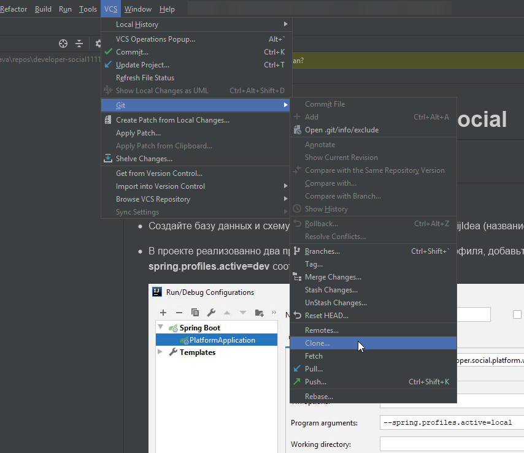
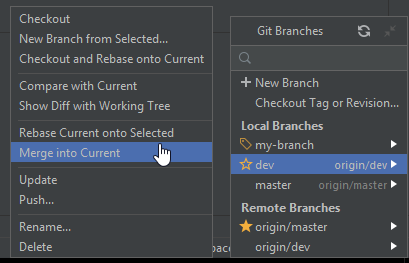
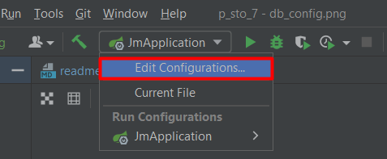
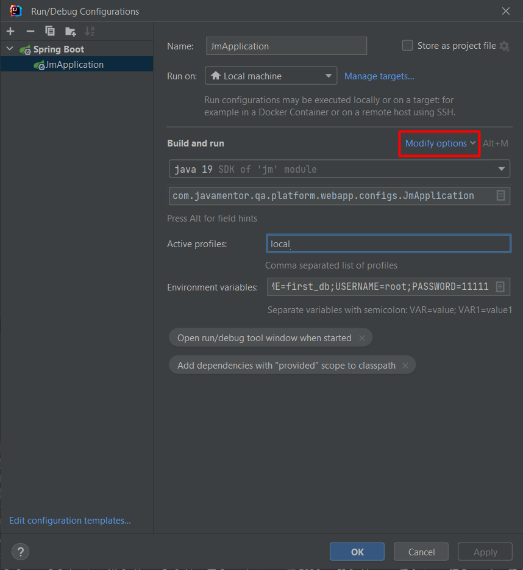
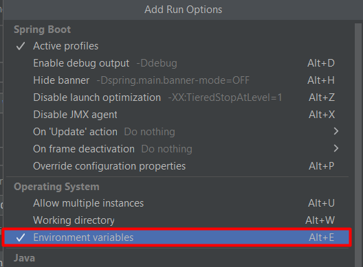
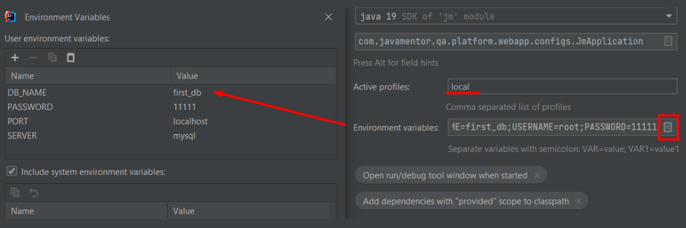
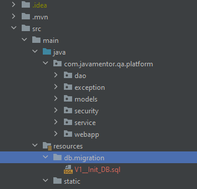
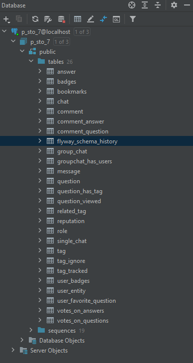

# Документация JMStack
## Работа c git
### Клонирование проекта

1. На странице репозитория убедитесь, что выбрана ветка **dev** (1), нажмите кнопку **Clone** (2), скопируйте ссылку (3).


2. Откройте **Intellij IDEA**, нажмите **Get from version control** на экране приветствия, либо **VCS | Git | Clone...** в меню.




3. Вставьте скопированную ссылку в строку **URL**, нажмите **Clone**.


### Перед внесением изменений в код
Создайте новую ветку в git-репозитории и работайте в ней. Для этого:
1. Нажмите на текущую ветку **dev** в правом нижнем углу.


2. Выберите **New branch**.


3. Введите название своей новой ветки (на ваше усмотрение) и нажмите **Create**.


### Добавление своего кода в общий репозиторий. Git push.

Прежде чем создать merge request вам необходимо подготовить вашу ветку к отправке в общий репозиторий.

1. Нажмите на текущую ветку в правом нижнем углу. Выберите опцию **dev | update**. 
Таким образом вы скачаете в свою локальную ветку **dev** все коммиты которые были замержены, 
пока вы работали в своей ветке.


2. Убедитесь, что в данный момент активна ваша рабочая ветка (занчек ярлыка слева от имени, как у ветки my-branch на скриншоте).
Выберите опцию **dev | Merge into Current**. Таким образом вы добавите все изменения из ветки **dev** в вашу ветку. При возникновении конфликтов разрешите их.



3. ---**ВАЖНО**--- Убедитесь что проект собирается и запускается.

4. Выберите вашу ветку и нажмите на **Push...**, чтобы добавить её в общий репозиторий.


### Создание merge request

1. Создайте новый merge request. В качестве **Source branch** выберите свою ветку, **Target branch** - **dev**.


2. Проверьте данные, допишите комментарии при необходимости. Обратите внимание на опцию **Delete source branch when merge request is accepted**.
Завершите создание реквеста, приложите ссылку на него в карточку таска на Trello.


## Сущности

### User

#### Поля:

- **id** - уникальный идентификационный номер пользователя;
- **fullName** - полное имя пользователя;
- **password** - пароль;
- **persistDateTime** - дата регистрации;
- **role** - идентификационный номер пользователя;
- **lastUpdateDateTime** - дата последней авторизации;
- **email** - адрес электронной почты;
- **about** - краткая информация о пользователе;
- **city** - город пользователя;
- **linkSite** - ссылка на сайт;
- **linkGitHub** - ссылка на github;
- **linkVk** - ссылка на страницу во Вконтакте;
- **reputationCount** - счетчик репутации;
- **isEnabled** - отметка, что учетная запись не заблокирована;
- **image** - фото пользователя;
```
Пользователь может задавать вопросы, отвечать на вопросы и давать комментарии к вопросам и ответам.
Наделен ролью.Может помечать понравившиеся вопросы, отмечать вопросы которые были полезны. Заданный
вопрос может отметить, как решенный, указав на ответ, который помог решить проблему.
```

### Role

#### Поля:

- **id** - уникальный идентификационный номер роли;
- **name** - имя роли;
```
Определяет порядок прав действий пользователя в системе.
```

### Question

#### Поля:

- **id** - уникальный идентификационный номер вопроса;
- **title** - заголовок вопроса;
- **description** - описание вопроса;
- **persistDateTime** - дата публикации вопроса;
- **viewCount** - количество просмотров;
- **user** - идентификационный номер пользователя, опубликовавший вопрос;
- **tags** - теги, которыми обозначен вопрос;
- **lastUpdateDateTime** - дата последней редакции вопроса или добавления ответа;
- **isDeleted** - флаг, помечающий объект, как удалённый. Отображаться при запросе данный вопрос не будет;
```
Сущность, которую инициализирует пользователь для публикации своего вопроса. Имеет заголовок, который кратко 
описывает суть вопроса, развернутое описание, с возможностью вставки фрагмента кода. Может быть помечен полями
“решен”, “любимый вопрос”. Отметка “решен” проставляется автором вопроса, с указанием ответа, который помог
решить возникший вопрос. Отметка “любимый вопрос” ставиться любым пользователем, который посчитал вопрос
актуальным и интересным. ”Тэг” проставляется автором вопроса, для классификации вопроса. Под вопросом может
также быть оставлен комментарий любым пользователем, включая автора вопроса.
```

### VoteQuestion

#### Поля

- **user** - пользователь, который отправил свой голос;
- **question** - вопрос, по которому ведётся голосование;
- **localDateTime** - дата и время отправки голоса;
- **vote** - значение голоса, который отправил пользователь по вопросу;
```
Таблица, которая содержит в себе записи голосования пользователей по вопросам. В таблице используется
сборный внешний ключ, который состоит из полей user, qustion, localDateTime. Для создания необходимо
передать сущности User, Question и значения голоса. Допускается передача значений только "1" и "-1".
Пользователь может проголосовать за один вопрос только с отклонением в 1 пункт. Допускается, что пользователь
может отменить свой голос, отправив противоположное значение предыдущего голоса. Или изменить свой итоговый
голос, при этом отправив повторно обратное значение. Все действия пользователя сохраняются в таблице.
Итоговое значение "полезности вопроса" является сумма всех голосов.
```

### Answer

#### Поля:

- **id** - уникальный идентификационный номер ответа;
- **user** - идентификационный номер пользователя, который опубликовал ответ;
- **question** - идентификационный номер вопроса, к которому относиться ответ;
- **htmlBody** - тело ответа;
- **persistDateTime** - дата публикации ответа;
- **updateDateTime** - дата публикации ответа;
- **isHelpful** - отметка, что именно этот ответ помог решить вопрос, к которому оно относиться. Эту
отметку может ставить только автор вопроса;
- **dateAcceptTime** - дата, решения вопроса;
- **isDeleted** - флаг, помечающий объект, как удалённый. Отображаться при запросе данный ответ не будет;
```
Сущность, которую инициализирует пользователь отвечая на вопрос. Привязан к сущности question. Ответ на
вопрос может оставлять любой пользователь. Может быть предложено несколько вариантов ответов на опубликованный
вопрос. Ответ может быть помечен автором вопроса, к которому был оставлен ответ, как “решение помогло”,
обозначая тем самым, что сам вопрос решён и помог прямо или косвенно данный ответ. Под ответом пользователи
могут оставлять комментарии, которые уточняют или дополняют предложенное решение. Каждый пользователь может
оставлять под вопросом только один ответ.
```
### AnswerVote

#### Поля

- **user** - пользователь, который отправил свой голос;
- **answer** - ответ, по которому ведётся голосование;
- **persistDateTime** - дата и время отправки голоса;
- **vote** - значение голоса, который отправил пользователь по ответу;
```
Таблица, которая содержит в себе записи голосования пользователей по ответам. В таблице используется
сборный внешний ключ, который состоит из полей user, answer, persistDateTime. Для создания необходимо
передать сущности User, Answer и значения голоса. Допускается передача значений только "1" и "-1".
Пользователь может проголосовать за один вопрос только с отклонением в 1 пункт. Не допускается, что пользователь
может отменить свой голос. Все действия пользователя сохраняются в таблице.
```


### Comment

#### Поля:

- **id** - уникальный идентификационный номер комментария;
- **user** - идентификационный номер пользователя, который оставил комментарий;
- **text** - содержание комментария;
- **persistDateTime** - дата публикации комментария;
- **lastUpdateDateTime** - дата последней редакции;
- **commentType** - тип комментария. Идентифицирует родительскую сущность, к которой был оставлен комментарий
(вопрос или ответ);
```
Комментарий оставляется пользователем под любым вопросом или ответом, для уточнения или дополнения к основному
посту.
```

### User_favorite_question

#### Поля:

- **id** - уникальный идентификационный номер записи об отмеченном вопросе;
- **persistDateTime** - дата постановки отметки “понравившейся вопрос”;
- **user** - идентификационный номер пользователя, который отметил вопрос, как понравившийся;
- **question** - идентификационный номер вопроса, который пользователь отметил, как понравившейся;
```
Отметка понравившегося вопроса проставляется пользователем, который счел вопрос интересным и/или полезным.
```

### Tag

#### Поля:

- **id** - уникальный идентификационный номер тега;
- **name** - название тега;
- **description** - описание тега;
- **persistDateTime** - дата создания тега;
- **questions** - список вопросов, которыми помечен данный тег;
```
Ставиться у сущности question для классификации вопроса.
```

### Related_tags

#### Поля:

- **id** - уникальный номер записи;
- **childTag** - идентификационный номер дочернего тега;
- **mainTag** - идентификационный номер родительского тега;
```
Категоризация тэгов. Показывает взаимосвязь общего с конкретным запросом. Например тэг “База данных” будет
иметь более широкую область запросов, в то время как тэг “Hibernate” будет более предметную область, которая
одновременно подходит под широкое использование тэга “База данных”.
```

### Tag_has_question

#### Поля

- **tag_id** - идентификационный номер тега;
- **question_id** - идентификационный номер вопроса;
- **persist_date** - дата отметки вопроса тегом;
```                                                  
Производная таблица связи many-to-many сущности вопросов и тегов.
```

### Editor

#### Поля:

- **id** - уникальный идентификационный номер редактора;
- **count** - правки сделанные за день
- **persist_date** - дата 
- **user_id** - идентификационный номер пользователя;
```
Сущность, которая хранит в себе историю редактирования вопроса, 
ответа или комментария сделанных пользователями.
```

### Moderator

#### Поля:

- **id** - уникальный идентификационный номер модератора;
- **persist_date** - дата назначения;
- **user_id** - идентификационный номер пользователя;
```
Сущность, которая хранит пользователей чей статус являеться модератором. 
Привилегия, выдаваемая системой в зависимости от уровня репутации участника.
```

### Reputation

#### Поля

- **id** - уникальный идентификационный номер репутации 
- **count** - баллы заработанные за день
- **persist_date** - дата 
- **user_id** - идентификационный номер пользователя
```
Сущность, которая хранит в себе историю репутации пользователей по дням. 
Новый день новая запись, для каждого пользователя (если пользователь заработал баллы иначе записи не будет).  
```

### Badges

#### Поля

- **id** - уникальный идентификационный номер знака 
- **badges** - имя знака
- **count** - минимальное количество очков репутации для получения знака
- **description** - описание знака
```
Сущность знаков.   
```

### user_badges 

#### Поля

- **id** - уникальный идентификационный номер знака 
- **ready** - имеет булевский тип, если помечается true знак получен
- **badges_id** - идентификационный номер знака
- **user_id** - идентификационный номер пользователя
```
Промежуточная сущность связывающая таблицы User и Badges.
User при регистрации получает все знаки лишь поле ready определяет заслужил пользователь знак или нет.
```

### Tag_ignored

#### Поля

- **id** - уникальный идентификационный номер знака 
- **user** - ссылка на профиль пользователя
- **ignoredTag** - ссылка на тег
- **persistDateTime** - дата добавления тега в справочник
```
Справочник тегов которые пользователь добавляет в игнорируемые
```

### Tag_tracked

#### Поля

- **id** - уникальный идентификационный номер знака 
- **user** - ссылка на профиль пользователя
- **trackedTag** - ссылка на тег
- **persistDateTime** - дата добавления тега в справочник
```
Справочник тегов которые пользователь добавляет в отслеживаемые 
```

### Bookmarks

#### Поля

- **id** - уникальный идентификационный номер закладки
- **user** - ссылка на профиль пользователя
- **question** - ссылка на вопрос
```
Таблица закладок
```

[Схема](https://dbdiagram.io/d/6086b027b29a09603d12295d)


## Как пользоваться конвертором MapStruct.

**MapStruct** - это генератор кода, который значительно упрощает реализацию сопоставлений между типами Java-компонентов
 на основе подхода соглашения по конфигурации.
Сгенерированный код сопоставления использует простые вызовы методов 
и, следовательно, является быстрым, безопасным по типам и простым для понимания.
Более подробно можно ознакомиться в официальной документации:https://mapstruct.org/ .

В текущем проекте **Developer Social** технология **MapStruct** используется,в основном, для 
преобразования **Dto** в **Entity** и наоборот.
Названия всех классов преобразования должны заканчиваться на «**Converter**» (например: **GroupChatConverter**) и должны храниться в пакете **converters**.
Такой класс должен быть абстрактным, помеченным аннотацией **@Mapper**.Эта аннотация отмечает класс
как класс сопоставления и позволяет процессору **MapStruct** включиться во время компиляции.
Методы должны быть абстрактными,из их названия должно быть явно понятно,какой класс
во что преобразуется. Например: (**chatDtoToGroupChat**- преобразует **ChatDto** в **GroupChat**).

Если соответствующие поля двух классов имеют разные названия, для их сопоставления
используется аннотация **@Mapping**. Эта аннотация ставится над абстрактным методом преобразования
и имеет следующие обязательные поля:

**source** - исходное поле преобразовываемого класса.
**target**- конечное поле класса,в котором должно быть значение из **source**.

Для разрешения неоднозначностей в именах полей классов можно указывать их с именем
соответствующего параметра метода преобразования.
например:(**source** = "**chatDto.title**", где **chatDto** - имя параметра метода преобразования)

По умолчанию, метод должен принимать объект преобразовываемого класса, но также
можно передавать различные другие параметры(например **Id**) и потставлять их в **source**,
чтобы в дальнейшем поле **target** приняло это значение.

Могут возникнуть ситуации,что нужно преобразовать поле в другой тип данных,например 
в коллекцию и наоборот.Тогда в аннотацию **@Mapping** следует добавить еще одно поле:
**qualifiedByName**, которое будет содержать имя метода, реализующего логику получения
нужного типа или значения. В таком случае этот метод должен быть помечен аннотацией
**@Named** c указанием названия для маппинга.
Ниже приведён общий пример:

````
{@Mapping(source = "chatDto.title", target = "title")
    @Mapping(source = "chatDto.image", target = "image")
    @Mapping(source = "userId",target ="users",qualifiedByName = "userIdToSet")
    public abstract GroupChat chatDtoToGroupChat(ChatDto chatDto,Long userId); }"
   

@Named("userIdToSet")
    public  Set<User> userIdToSet(Long userId) {
        User user = userService.getById(userId);
        Set<User> userSet = new HashSet<>();
        userSet.add(user);
        return userSet;
    }
````

## Как добавить свои настройки для базы данных.

Для того, чтобы подключиться к локальной базе данных на своём компьютере без изменения **application.properties**, потребуется выполнить следующие действия.

Нажмите на **JmApplication** и выберите **Edit configurations**:



Выберите **JmApplication** слева, затем нажмите **Modify options**:



Здесь можно добавить различные опции помимо дефолтных. Поставьте галочку на пункте **Environment variables**:



Выберите нужный профиль. **Local** предназначается для вашей, локальной базы данных, **dev** - для продакшена.

Чтобы было удобнее вписывать данные настроек в формате ключ-значение, в строке **environment variables** можно нажать на выделенную кнопку.
После этого требуется ввести ваши настройки под **следующими ключами** (ничего не менять):

DB_NAME, SERVER, PORT, USERNAME, PASSWORD

После этого ваши настройки автоматически вставятся в **application.properties** и вы сможете запустить приложение.



## Структура тестов.

1) Тесты создаются согласно REST контроллерам, например, если есть **ResourseAnswerController**, то есть тест **TestResourseAnswerController** и тестируются все api из контроллера.


2) В пакете **dataset/expected** лежат все датасеты для сравнения получившейся базы данных после завершения теста, данные датасеты не используются для обычной загрузки данных для тестов и используются только для операции DELETE, UPDATE, PERSIST.


3) Все сущности описанных в датасетах для загрузки тестовых данных начинаются с id = 100 (никакого отношение к датасетам из expected это не имеет).


4) Все тестовые классы должны наследоваться от абстрактного класса, где описана все конфигурация тестов.


5) НЕЛЬЗЯ ИЗМЕНЯТЬ НАПИСАННЫЕ УЖЕ ДАТАСЕТЫ! Если хотите добавить данные, создаете подпакет для вашего конкретного теста и пишете свои датасеты для этого теста.


6) На каждый класс тестов написаны отдельные датасеты, в случае, где их нужно изменить, применяется п. 5. Например, если мы тестируем **ResourseAnswerController**, есть подпакет **dataset/[название пакета]** и там лежат все датасеты, нужные для тестирования этого контроллера.


7) Нельзя использовать аннотации транзакции для тестов.


8) Нельзя ставить аннотацию DataSet над классом, для каждого отдельного метода теста стоит свой датасет.


9) Все классы для тестов должны находиться в папке **.../api**

## Миграции БД (FlyWay)

1. **ОПИСАНИЕ**

**Flyway** — это инструмент для контроля версии базы данных.
Любой проект не совершенен, поэтому спланировать и составить окончательную версию проекта редко получается.
Каждый раз появляются те или иные неучтенные нюансы, по типу:

- После изменения структуры, если мы захотим вернуться назад, как мы узнаем, в каком именно состоянии сейчас находится структура БД?
- Как мы можем быть уверены, что изменение БД прошло успешно?
- Как получить возможность отследить все изменения БД, которые прошли на проекте?

Все это помогает решить использование инструмента для миграции БД, например, **Flyway**.

2. **ПРИНЦИП РАБОТЫ**

В рамках проекта мы храним отдельные sql файлы (так называемые миграции), которые хранят в себе все то, что мы делаем с БД за один раз.
Все миграции идут строго в определенном порядке, что позволяет отследить изменения в структуре и данных БД.

При сборке проекта запускаются миграции. Они соединяются с базой данных и проводят миграции.

Если миграции уже были проведены на этой базе данных, то **Flyway** их просто пропустит
(у него в БД в отдельной таблице хранятся данные о миграциях, об их состоянии, что помогает управлять ими),
а если какая-то миграция прошла неуспешно, то сборка проекта и его монтирование (деплой) на сервер остановятся.

3. **ИСПОЛЬЗОВАНИЕ**

При любом планируемом изменении БД — создаем файл миграции по шаблону **V<"VERSION">__<"NAME">.sql** в соответствующей папке:
**/src/main/resources/db.migration/**. В которой описываем изменение БД SQL-кодом.



После запуска программы исполняется миграция V1 и создается новая таблица **flyway_schema_history**.




Версия, описание миграции, какой тип SQL, имя самого скрипта, **чексумма** (это что-то типа hashcode,
при помощи которого проверяется, изменилась или нет миграция. Делается это на случай, если мы провели миграцию в БД
и потом ее поправили: делать этого нельзя, все правки вносятся только посредством новой миграции
и чтобы этого не было, чек сумма следит за этим), имя SQL юзера, дата обработки миграции, время на выполнение и результат.

Миграция, написанная один раз, не должна быть изменена в будущем. Даже если в ней находится дефект.
Все изменения проходят только посредством новой миграции. Это очень важно
(иначе приложение не запуститься и в консоле будет выведена разница **чексумма** предыдущей миграции и нынешней)


При добавлении следующей миграции (например, V2) запустятся все миграции после нынешней версии (V1), т.е. новая V2.

Если запустить еще раз проект, то **Flyway** просто пропустит накатывание миграций, так как база данных полностью соответствует необходимой версии.

Теперь вносите все изменения нашей БД через миграции **Flyway**.

## Работа с Swagger
**Swagger** - это фреймворк, позволяющий автоматически, на основании кода и аннотаций генерировать и обновлять интерактивную веб-документацию (Swagger UI) на ваши REST API, в которой их можно непосредственно тестировать, отправляя запросы и получая ответы.

Для целей документации, по минимуму методы контроллера помечаются аннотацией например так:
**@ApiOperation("Получение списка всех пользователей")**
Swagger имеет также и другие полезные аннотации, рекомендуется их найти и изучить.

Для тех кто будет писать контроллеры и расписывать их аннотациями Swagger, документацию по созданному вами api можно будет смотреть и проверять здесь: **http://localhost:8080/swagger-ui/**

Сама документация будет формироваться автоматически на основании кода и аннотаций, ничего дополнительно обновлять или делать не нужно, в этом одна из прелестей Swagger.

## @Api аннотация
Описывает API верхнего уровня. Классы с аннотациями @Api будут включены в список ресурсов.

Параметры аннотации:

**value** – краткое описание API
**description** – общее описание этого класса
**basePath** – базовый путь, который предшествует всем элементам @Path
**position** – необязательный явный порядок этого Api в списке ресурсов
**produces** – тип контента, произведенный этим API
**consumes** – тип носителя, потребляемый этим API
**protocols** – протоколы, которые требует этот API (то есть https)
**authorizations** – разрешения, требуемые этим API

## @ApiOperation аннотация
Описывает операцию или, как правило, метод HTTP для определенного пути. Операции с эквивалентными путями сгруппированы в массив в объявлении Api.

Параметры аннотации:

**value** – краткое описание операции
**notes** – длинное описание операции
**response** – класс response умолчанию от операции
**responseContainer** – если класс ответа находится внутри контейнера, укажите его здесь
**tags** – в настоящее время не реализованы в читателях, зарезервированы для будущего использования
**httpMethod** – метод HTTP , т.е. GET , PUT , POST , DELETE , PATCH , OPTIONS
**position** – разрешить явное упорядочение операций внутри декларации Api
**nickname** – псевдоним для операции, чтобы переопределить то, что обнаружено сканером аннотаций
**produces** – тип контента, произведенный этим API
**consumes** – тип носителя, потребляемый этим API
**protocols** – протоколы, которые требует этот API (то есть https)
**authorizations** – разрешения, требуемые этим API
Вы можете заметить использование параметра ответа в аннотации @ApiOperation который указывает тип ответа (тип возвращаемого значения) от операции. Как видите, это значение может отличаться от типа возвращаемого значения метода, поскольку оно служит только для целей документации API.